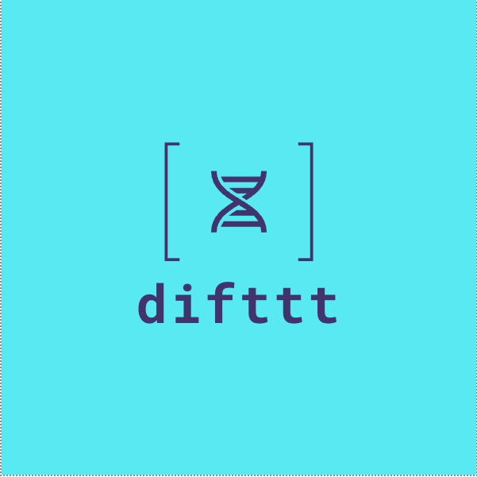
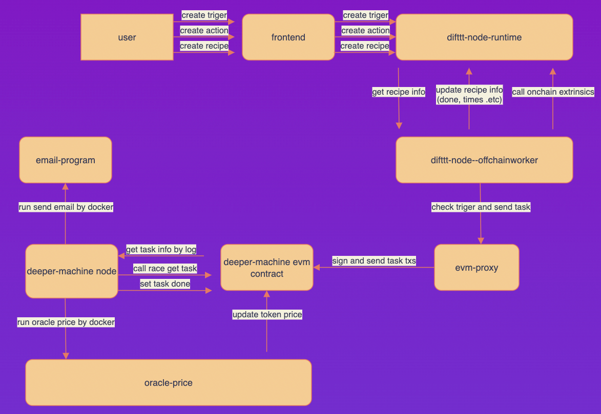

## basic information

project name: difttt

Project initiation date (year and month): 2022-05

## Project overall introduction

Polkadot's blockchain applications are becoming more and more complex, and I am wondering what applications can use a common interface to make it easier for ordinary people to use blockchain applications.

The project core topic is web3-based automatic triggers. You may have heard of IFTTT. The power-on point solved is greatly improve convenience, and reduce the threshold for users to enter the blockchain, and ensure the stability of execution and the privacy of trigger publishers and executors.serve as one of the infrastructures of web3. The targeted areas include life services, smart home, cross-chain operations, and Defi.

DIFTTT has partnerships with different service providers that supply event notifications to DIFTTT and execute commands that implement the responses. Some event and command interfaces are simply public APIs, Some Action May be a blockchain opration, or Docker Task.

DIFTTT employs the following concepts:
-  Triggers are the "this" part of an recipes. They are the items that trigger the action. 
-  Actions are the "that" part of an recipes. They are the output that results from the input of the trigger.
-  Recipes are the predicates made from Triggers and Actions. For example, if you like a token indicator (trigger), an DIFTTT app can buy token base the indicator conditions (action).

### Planning for the last few months
- [ ] Improve code stability
- [ ] Improve the defi application (purchase tokens according to the indicators)
- [ ] Passed the security review and launched the beta version

## What to do during the hackathon

**Blockchain side**
- `difttt-node`
  - [x] Triger creation (`fn create_triger()`)
  - [x] Action creation (`fn create_action()`)
  - [x] Recipe creation (`fn create_recipe()`)
  - [x] Delete Recipe (`fn del_recipe()`)
  - [x] Enable recipe (`fn turn_on_recipe()`)
  - [x] Disable recipe (`fn turn_off_recipe()`)
  - [x] Check the triger condition, and run the action (`fn offchain_worker()`)
  
**Client**

- web side(react)
  - [x] Triger/Action/Recipe create page
  - [x] Triger/Action/Recipe list page

- evm-proxy(rust)
  - [x] pass action to DEP(a Distributed Task System)

**TaskImages**
- [x] email docker image
- [x] oracle docker image

## What was accomplished during the hackathon (submitted before the June 22nd trial)
the Demo program has some interesting example:
- [x] price greate then/price less than triger -> email
- [x] timer triger -> price oracle
- [x] token indicator triger-> buy token

## Player information

Eclipse is a team from China, team members have many years of blockchain experience.
- Bin Guo, a Senior blockchain product manager, mastered blockchain development technology and theoretical knowledge, and led the completion of more than ten large-scale and super-large-scale projects.

- Li Smith, a blockchain developer,the hackathon team leader.Years of experience in substrate development, familiar with rust、c++. Developed block explorer, exchange gateway, avatar nft, domain name system, etc.(github: baidang201)

- Leon, a frontend developer,Familiar with frontend and node, recently learning rust and substrate.(github: walle233).

- Shiyivei, a blockchain developer, Familiar with blockchain development (go rust), familiar with solidity, and understand react.(github: shiyivei).