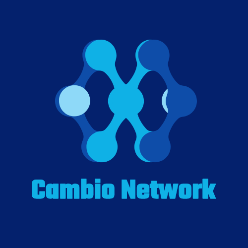

## 基本资料

项目名称：Cambio Network

项目立项日期 (2022年5月)：

## 项目整体简介

Cambio Network 旨在构建一个波卡生态中的高效, 大吞吐量, 极低费用的Name Service.
在Cambio Network上, 用户可以注册/查询/管理域名, 将繁琐难记的账户公钥地址, Contract地址置于容易记忆的域名背后.

目前已经有的Name Service项目如以太坊的ENS等, 都是基于智能合约开发, 效率和吞吐量存在较大限制, 且受制于公链本身的gas fee, 其使用费用较高.
一个好用且费用低廉的Name Service, 会极大降低普通用户使用web3.0各项服务的难度.

因此我们团队计划基于substrate这一高效灵活的开发框架, 基于Pallet和offchain workers来实现一个高效, 大吞吐量且费用低廉的Name Service.

## 黑客松期间计划完成的事项

**区块链端**

- `pallet-name`
  - [ ] 域名 创建
  - [ ] 域名 管理

**客户端**

- web 端
  - [ ] 域名注册页面
  - [ ] 域名创建流程
  - [ ] 域名管理

## 黑客松期间所完成的事项 (7月5日初审前提交)

- 7月5日前，在本栏列出黑客松期间最终完成的功能点。
- 把相关代码放在 `src` 目录里，并在本栏列出在黑客松期间打完成的开发工作/功能点。我们将对这些目录/档案作重点技术评审。
- 放一段不长于 **5 分钟** 的产品 DEMO 展示视频, 命名为 `团队目录/docs/demo.mp4`。初审时这视频是可选，demo day 这是计分项。

## 队员信息

彭亚伦  github: arstman

李笑宇  github: g302ge

朱博 github: xabozhu

赵健    github: zhoajiann

