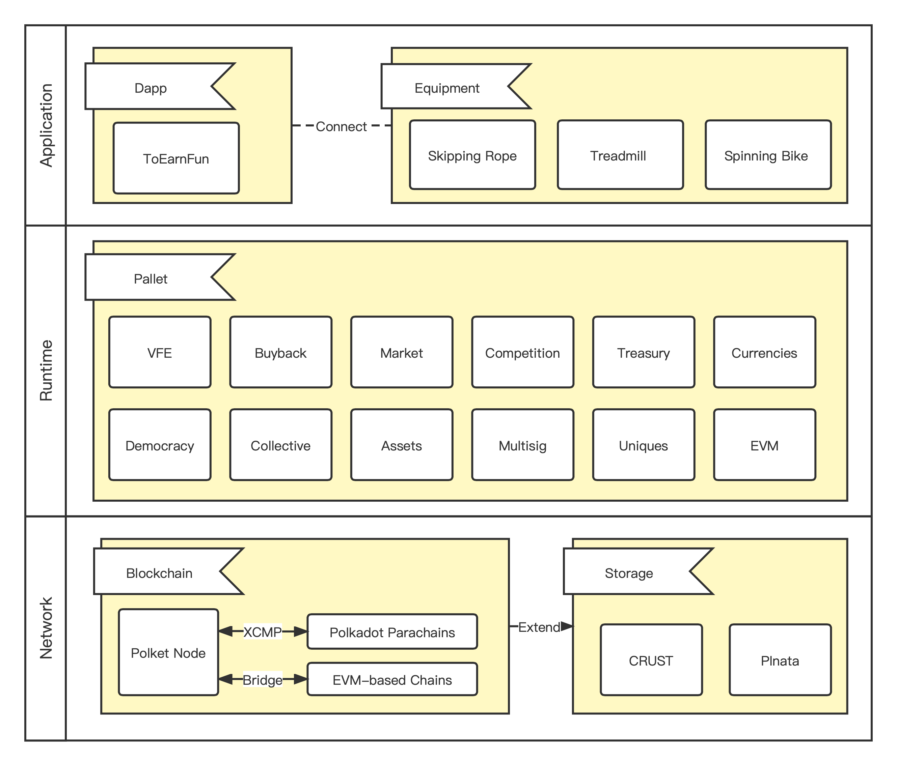

## Project

Project Name: ToEarnFun

Project Start Date: May 2022

## Introduction

**ToEarnFun** is a **fit to earn** Web3 smart fitness application. Compared with other **x-to-earn** applications that only have **SocialFi** and **GameFi** elements, it can be connected with real smart fitness equipment. It relies on the encryption technology of the hardware chip to ensure that the sweat is paid fairly. The entry-level users of **ToEarnFun** do not need to purchase cryptocurrencies, but only need to purchase smart fitness equipment adapted to the application, and they can **fit to earn** immediately, greatly reducing the difficulty for ordinary users to enter the web3 world.

### Architecture

### Why ToEarnFun?

- Easy To Use.
- Fitness + GameFi.
- Hardware-level Anti-cheating Technology.
- Completely Decentralized Implementation.
- Sustainable Monetization.
- Flexible Fee Mode.
- Community Driven Development.
- Interoperability Of Cross-chains.

### What can ToEarnFun do?

- Promote the production and sales of fitness equipment.
- Fitness + GameFi
- VFE Market.
- Competition Challenge.

For more details, please [click here](./docs/README.md).
We also made a Chinese version of the PPT, [click here](./docs/toearnfun-ppt.pdf).

## What to plan to accomplish during the hackathon

**Blockchain**

- `pallet-currencies`
  - [x] Support transfer multi-currencies (`fn transfer()`)
  - [x] Support specific origin transfer multi-currencies (`fn force_transfer()`)
  - [x] support transfer native token (`fn transfer_native()`)
  - [x] implemented `frame_support::traits::tokens::fungibles::{Inspect, Mutate, Transfer}`

- `pallet-vfe`
  - [x] Create VFE type (`fn device_type_create()`)
  - [x] Equipment producer Registration (`fn producer_register()`)
  - [x] Change of owner of the producer ledger (`fn producer_owner_change()`)
  - [x] Producer deposit (`fn producer_charge()`)
  - [x] Producer withdraw (`fn producer_withdraw()`)
  - [x] Register fitness equipment (`fn register_device()`)
  - [x] VFE binding equipment (`fn bind_device()`)
  - [x] VFE unbinding equipment (`fn unbind_device()`)
  - [x] VFE instance minting (`fn do_mint()`)
  - [x] VFE instance transfer (`fn transfer()`)
  - [x] Training report (`fn sport_upload()`)
  - [ ] Energy recovery

**Client**

- Smart skipping rope
  - [x] Encryption Algorithm Interface
  - [x] Bluetooth communication protocol

- App 端
  - [ ] Initialize account and wallet
  - [ ] Bind fitness equipment
  - [ ] My VFE
  - [ ] Training report
  - [ ] My wallet

## What was accomplished during the hackathon (submitted before the June 22nd trial)

- Completed the project concept documentation, in `docs/README.md`.
- The `smart skipping rope` product has integrated an encryption algorithm and adds a hardware-level anti-cheating algorithm.
- Created the substrate project and completed the development of `pallet-vfe`, in `src/polket-node`.
- Completed the UI design of the App, in `src/ui`.

## Demo Video

https://drive.google.com/file/d/1hpaKNFYQhYxkj0dNOEaRD81jcSrm66h3/view?usp=sharing

## Team members

| Name                                         | Role                 | Introduction                                                                                                                                                                                                                          |
|----------------------------------------------|----------------------|---------------------------------------------------------------------------------------------------------------------------------------------------------------------------------------------------------------------------------------|
| [Mai zhiquan](https://github.com/zhiquan911) | Project Manager      | Engaged in the development of open source blockchain technology for many years, and created excellent frameworks such as [openwallet](https://github.com/blocktree/openwallet/). Currently fully devoted to the construction of Web3. |
| [Doxin Liang](https://github.com/metadex003) | Blockchain Developer | Excellent graduate of the Substrate advanced course, with 6 years of blockchain-related development experience.                                                                                                                       |
| [Arrom](https://github.com/shenzhen-arrom)   | Mobile Developer     | Participated in several hackathons organized by Polkadot and Ethereum.                                                                                                                                                                |
| [Fany](https://github.com/fanyinghao)        | Front-end developer  | Has many years of Dapp development experience.                                                                                                                                                                                        |

