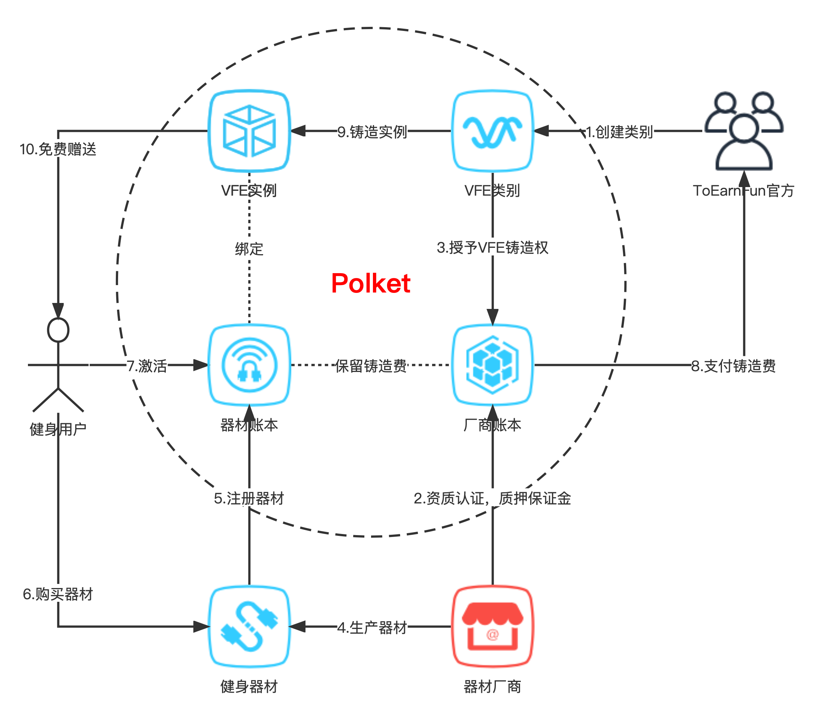
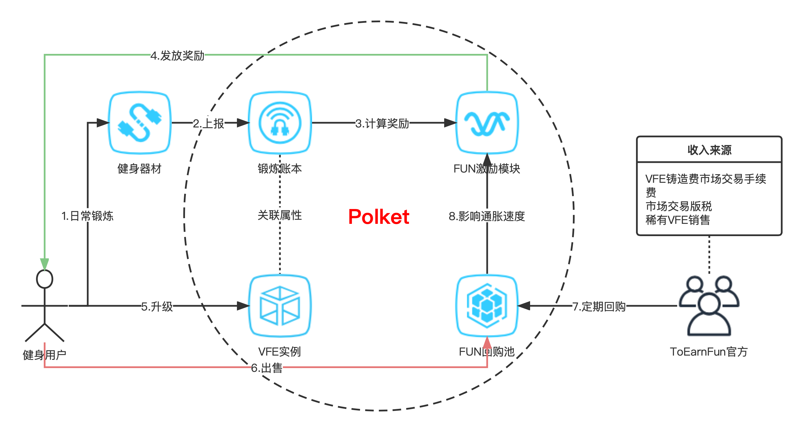
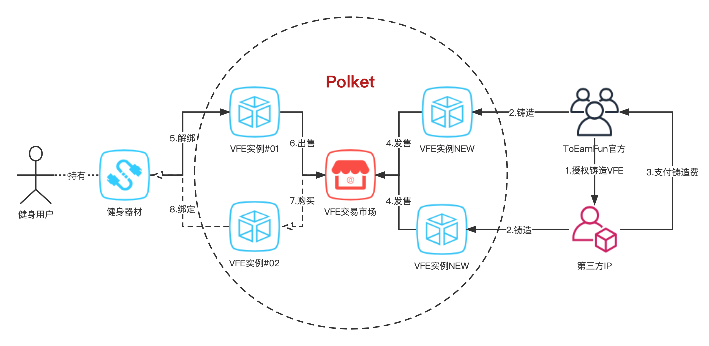
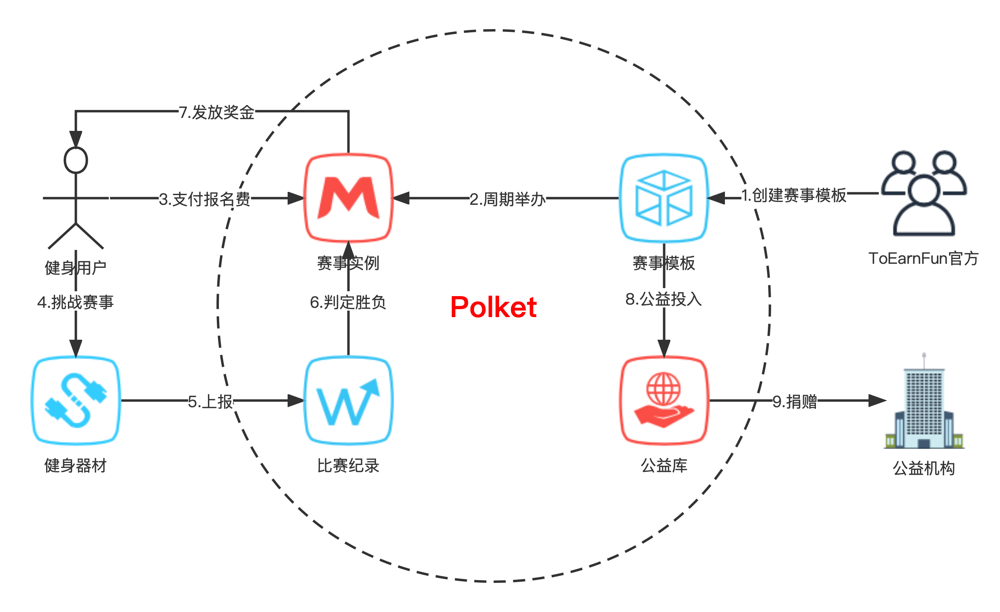

# ToEarnFun

## Where did the idea come from?

受到**STEPN**成功的启发，我们对结合生活场景的Web3应用有了很大的信心。因为要想让广大用户进入Web3世界，以生活场景的交互方式是最容易的入口。所以我们从健身领域出发，开发一款Web3智能健身应用程序，让普通用户拿起健身器材，每日健身锻炼+GameFi，慢慢了解Web3世界如何给他们带来更多价值和乐趣。

虽然**STEPN**一将推出就获得了巨大成功和耀眼的关注，但也暴露出如下诸多的问题：

1. **门槛高风险高**。入门用户首先要有加密货币，并购买至少一双虚拟跑鞋，才能开始锻炼。由于加密货币长期价格不稳定，用户把握入市时机不准，可导致严重损失。
1. **去中心化不足**。**STEPN**和大多GameFi一样，采用了以**资产交易去中心化，游戏玩法中心化**的方案来实现。这是因为受限于目前智能合约技术的瓶颈，无法做到完去中心化，所以游戏系统存在监守自盗风险，如：虚增奖励，恶意封号，停止服务等操作。
1. **激励机制不可持续**。**STEPN**跑步锻炼产生的激励代币不受限地自由流通，商业模式上是不可持续的，最终也会进入死亡螺旋。
1. **真的是跨链吗？**。虽然**STEPN**在两条公链上都发布的同类资产，但资产价值不同，不是真正意义上的跨链。

注意到以上问题后，我们在技术选型上，最终采用**Substrate**作为底层技术，开发了一条区块链，将其命名为**Polket**。**Polket**的目标是为NFTs创建更多商业应用场景，并以平行链方式连接到Polkadot/Kusama网络。基于**Polket**链，我们将开发一款智能健身类型的Web3应用，实现**STEPN**无法实现的能力，我们将其命名为**ToEarnFun**，意思就是**去获得乐趣**。

## What is ToEarnFun?

**ToEarnFun**是一款**fit to earn**的Web3的智能健身应用程序。相对于其它只有**SocialFi**和**GameFi**元素的**x-to-earn**应用，它能够与真实的智能健身器材连接，依靠硬件芯片的加密技术，保证付出的汗水得到公平的回报。**ToEarnFun**的入门用户无需购买加密货币，只需要购买应用适配的智能健身器材，即可马上**fit to earn**，大大降低普通用户进入web3世界的门槛。

## Why ToEarnFun?

### 简单易上手

健身器材厂商通过**ToEarnFun**官方资质认证后，厂商每生产一件健身器材都把芯片公钥注册到区块链上。用户在商店购买**ToEarnFun**适配的健身器材，并在App完成激活，即可在链上免费获得一个**VFE**(**Virtual Fitness Equipment**，可理解为**NFT**的一个种类)。用户每日通过健身器材锻炼，系统根据链上**VFE**属性值计算出对应获得的奖励。

相对STEPN要求用户使用加密货币购买**Sneaker**，**ToEarnFun**无需用户接触加密货币，在销售方式上更容易满足地区的合规要求。**ToEarnFun**社区是由真正有健身需求的用户群体组建，同时也是对Web3未来积极看好的群体。为Web2用户进入**Polkadot生态系统**打开了一道大门。

### 健身锻炼+GameFi

**ToEarnFun**不仅具备智能健身应用的优点，同时实现了**GameFi**的玩法。游戏核心以**VFE**作为玩法，**VFE**有等级系统，具有四项基本属性(效率，技巧，运气，耐久)，四种稀有度（普通，精英，稀有，史诗），和可用电量。用户激活器材时免费获得一个稀有度普通且等级为0的**VFE**。用户通过每日锻炼消耗能量赚取**FUN**，**FUN**是**VFE**玩法上的消耗品，用于：提升**VFE**等级，**VFE**充电，合成**VFE**，交易手续费，挑战赛事等等。**VFE**每升一级获得属性点数，用户可自主配置属性。

**基础属性说明：**

- **效率**：影响**FUN**收入量，效率越高收入增长越稳定，推荐入门用户配置。
- **技巧**：影响锻炼评分因数，技巧越高，锻炼评分转化**FUN**收入越高。锻炼评分可使收入倍增倍减，推荐高级用户配置。
- **运气**：影响道具掉落概率和链上随机数增加的收入量。
- **耐久**：影响**VFE**充电成本。

**稀有度说明：**

- **普通**：购买健身器材免费获得。
- **精英**：收集**VFE**零件，结合**VFE**芯片组合成新**VFE**，小概率获得。
- **稀有**：**ToEarnFun官方**定期销售获得。
- **史诗**：参与**ToEarnFun官方**赛事获得。

基础属性和升级点数，**普通 < 精英 < 稀有 < 史诗**。

### 硬件级防作弊技术

我们在健身器材上要求器材厂商做到硬件级的防作弊，通过运动传感器，芯片加密技术，防止制造虚假运动数据和透过App端篡改数据，保证用户付出的汗水得到公平的回报。

### 完全去中心实现

大多**GameFi**应用都以**资产交易去中心化，游戏玩法中心化**的方案来实现。因为大多数Dapp都基于智能合约实现，受限于智能合约的执行效率和升级困难，很难做到去中心化的玩法实现。得益于**Substrate**无叉升级特点，我们能够把玩法实现到链上，后续更多新玩法可通过**Runtime**升级来实现，这将会是真正意义上的Web3应用。

### 可持续的变现方式

**FUN**作为用户健身锻炼的回报，不仅用于**VFE**的玩法上，还有其他可变现方式。**FUN**不会自由流通，防止外围炒作。**ToEarnFun官方**将创建**FUN回购池**，定期使用**国库**资产回购用户投放到池中的**FUN**。究竟使用多少比例的国库资产回购**FUN**，由社区提案，并由**FUN持有者**投票决定。

### 灵活手续费模式

得益于**Substrate**，系统能做到从设备提交的锻炼数据无需交易费，在**VFE**玩法上可以选择不同资产做交易手续费。

### 社区驱动发展

我们采用和**Polkadot**一样的链上民主治理模块，不断吸纳社区意见，让系统发展得更公平，让**FUN持有者**获得更多权益。

### 跨链互操作

**Polket**目标是以平行链方式连接到**Polkadot/Kusama**，使得**ToEarnFun**用户能够接触到**Polkadot**的其他平行链。通过跨链互操作，用户在**ToEarnFun**应用上能直接体验**DeFi**，**Staking**，**DEX**等等功能。

> 关键字解析：
> - `VFE`是`Virtual Fitness Equipment`的简写。可以理解为`NFT(non-fungible token)`的一个子类。我们将在链上创建`智能跳绳`、`智能呼啦圈`、`智能拳击`、`动感单车`等`VFE`。用户获得的是`VFE`铸造出来的独一无二的`VFE实例`。
> - `FUN`是`ToEarnFun官方`在`Polket`链发行的数字令牌，用于激励用户日常健身锻炼。

## What can ToEarnFun do?

### 促进健身器材生产销售

参与方：**健身用户**，**器材厂商**，**ToEarnFun官方**。

1. **ToEarnFun官方**首先需要在链上创建**VFE**类别，我们第一个实现的就是**跳绳项目**的**VFE**。
1. 器材厂商要与**ToEarnFun**合作，需要完成资质认证，并质押一定数量保证金到链上的**厂商账本**，用于后续铸造**VFE**实例扣费。
1. 根据器材厂商质押的保证金数量，系统授予厂商一定数量的**VFE**铸造权。
1. 器材厂商完成资质认证后，在健身器材芯片中集成**toearnfun-crypto-sdk**，实现加密协议。
1. 健身器材出厂前需要注册上链到**器材账本**，链上将从**厂商账本**中保留一笔铸造费。
1. 健身用户无需加密货币，在实体店就可以购买**ToEarnFun**合作的健身器材。
1. 健身用户通过**ToEarnFun**应用对健身器材完成链上激活。
1. 健身器材激活成功，**厂商账本**将从保留余额中支付一笔铸造费给**ToEarnFun官方国库**。
1. 因为厂商有该**VFE**类别的铸造权，链上将铸造一个**VFE**实例给健身用户。
1. 健身用户能免费获得一个**VFE**实例，其实就是厂商注册器材上链时支付了铸造费用。

这个商业模式不仅帮助传统健身器材厂商进入Web3世界，扩大了用户群体，促进产业发展，同时能够为**ToEarnFun**带来稳定收入，为后续**GameFi**上的**FUN**激励模块提供基础。

### 健身锻炼+GameFi

参与方：**健身用户**，**ToEarnFun官方**。

1. 健身用户使用健身器材进行日常锻炼。
1. 健身器材签名锻炼数据，经App上报到链上**锻炼账本**。
1. 根据健身器材绑定的**VFE**属性和锻炼消耗能量数计算奖励。
1. **FUN**激励模块向健身用户发放奖励，但每日有奖励上限。
1. 健身用户可使用**FUN**对**VFE**实例升级，提升属性点数。
1. 健身用户可以多余的**FUN**出售到**FUN回购池**。
1. **ToEarnFun官方**定期在池中回购FUN。
1. 每次回购**FUN**后，其回购价格都会变动。为了保证价格稳定，**FUN回购价**的变化将影响其通胀速度。

这个商业模式不仅让喜欢健身的用户获得其付出汗水等价的回报，也让沉迷**GameFi**的用户有了要健身的目标。

### VFE交易市场

参与方：**健身用户**，**ToEarnFun官方**，**第三方IP**。

1. **ToEarnFun官方**可以有偿授予第三方IP第一定数量的**VFE**铸造权。
1. 无论是**ToEarnFun官方**还是第三方IP，只要有**VFE**铸造权都可铸造新的**VFE**实例。
1. 然而第三方IP每铸造一个**VFE**实例，都需要支付铸造费给**ToEarnFun官方**。
1. 新铸造的**VFE**实例将会投放到**VFE**交易市场中，将以拍卖或一口价方式发售。
1. 健身用户可以消耗**FUN**解绑器材上的**VFE**实例。
1. 解绑后的**VFE**实例可以自由定价出售到**VFE**交易市场。
1. 健身用户也可以在**VFE**交易市场购买心仪的**VFE**实例。
1. 健身用户购买属性更好的**VFE**实例，再绑定到器材上进行锻炼，是最有效的赚**FUN**方案。

相比传统游戏，**GameFi**具有可玩、可拥有的特点，游戏物品有了价值。**ToEarnFun官方**可以通过发售**VFE**带来收入，也可以有偿授权第三方IP铸造**VFE**带来收入。健身用户也可以在交易市场自由交易**VFE**实现套利。

### 公益赛事挑战

参与方：**健身用户**，**ToEarnFun官方**，**公益机构**。

1. **ToEarnFun官方**创建赛事模板，设置：报名费，报名要求，比赛要求，评分规则，奖金分配，周期时限等等。
1. 赛事模板将按周期发布赛事实例。
1. 健身用户符合报名要求都可以支付报名费参加赛事。
1. 健身用户按照比赛要求使用自己的健身器材进行挑战。
1. 健身器材将运动数据上报到链上比赛纪录。
1. 比赛结束后比赛纪录按照赛事的评分规则判定胜负。
1. 赛事将向胜利方发放奖金。
1. 赛事所集资金的一份部分将投入到**公益库**。
1. **公益库**的资金可通过公益理事会提案捐赠给公益机构。

利用区块链来实现公益赛事是一个相当合适的应用场景，它不仅让比赛做到公平、公开、透明，也大大减少了人工成本，让**公益库**获得更多资金。同时利用**DAO**来管理**公益库**，确保了公益事业的可持续发展。

## Product highlight

## Maketing highlights 

| 对比项   | 传统智能健身 | STEPN        | ToEarnFun               |
|----------|--------------|--------------|-------------------------|
| 真实产品 | ⭕️           | ❌            | ⭕️                      |
| 日常锻炼 | ⭕️           | ⭕️           | ⭕️                      |
| GameFi   | ❌            | ⭕️           | ⭕️                      |
| 代币激励 | ❌            | ⭕️           | ⭕️                      |
| 去中心化 | ❌            | ❓            | ⭕️                      |
| 生态系统 | In-App       | Solana/BSC   | Polkadot                |
| 用户群体 | 健身爱好者   | 区块链爱好者 | 健身爱好者，区块链爱好者 |
| 产品价格 | 跳绳$29.99   | Sneaker≈$156 | 跳绳 Est. $69.99        |
| 收入来源 | 器材销售     | Sneaker销售  | VFE铸造费，VFE销售       |

## Future planning

- 0️⃣阶段：参加Polkadot黑客松，时间2022-06。
    - 编写相关技术开发文档。
    - 完成产品Demo，实现fit to earn。
    - 寻找市场运营合伙人和天使投资人。
- 1️⃣阶段：发布测试版，时间预估**2022-Q2**内完成。
    - 实现**健身器材生产销售场景**，完成首批**智能跳绳**器材生产。
    - 实现**健身锻炼+GameFi场景**的第一个类别**跳绳**，组建**ToEarnFun跳绳爱好者社区**，邀请内测用户。
    - 部署**Polket**的**POA**测试网络，发布**ToEarnFun App Beta**。
- 2️⃣阶段：平行链竞拍，时间预估**2022-Q3**内完成。
    - **Polket**参与**Kusama**平行链竞拍，公开众贷计划。
    - 实现平行链接入，发布主网。
    - 在**合规地区**正式发售首批ToEarnFun智能跳绳器材。
    - 实现FUN回购池功能。
    - 实现社区互动功能。
- 3️⃣阶段：VFE交易市场，时间预估**2022-Q4**内完成。
    - 实现**VFE交易市场**功能并上线主网。
    - 开启**FUN回购计划**。
    - 扩大跳绳器材的销售地区。
- 4️⃣阶段：公益赛事，时间预估**2023-Q1**内完成。
    - 实现**公益赛事**功能并上线主网。
    - 组建公益DAO，寻找公益机构合作。
    - 实现XCMP，与其他平行链实现跨链互操作。
- 🗓未来计划：
    - 官方定期销售稀有款VFE。
    - 官方定期举办公益赛事。
    - 支持更多**智能健身器材**连接。
    - 实现自主制作订阅付费形式的训练计划课程。
    - 实现商城模块，建立更多商业合作。

## Team members

