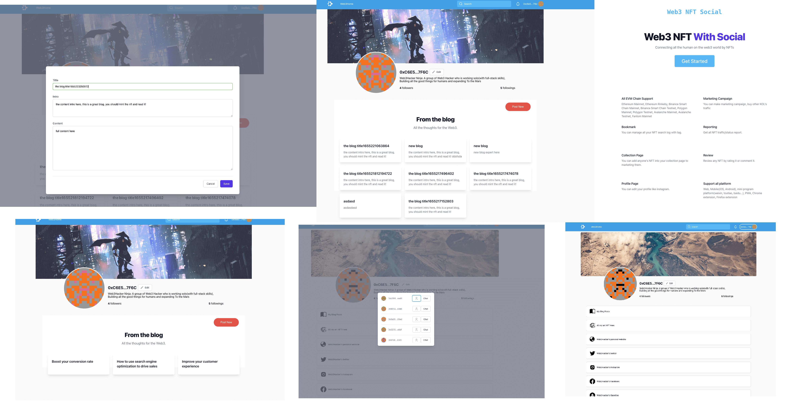

# Web3NFT.Social(English)

## Project Info

* Project Name: Web3NFT.Social
* Project Start Time: 2022-05-20
* Online Demo: [Online Link](https://moonbasealpha.web3nft.social/0xC6E58fb4aFFB6aB8A392b7CC23CD3feF74517F6C)
* Video Demo: [video Link](https://github.com/NftTopBest/moonbasealpha-for-polka)
* Source code: [code Link](https://github.com/NftTopBest/moonbasealpha-for-polka)
* Keynote(pdf version): [keynote Link](https://github.com/NftTopBest/keynote.pdf)

Web3NFT.Social arm to make every web2 creator easily create products and earn on web3.
AKA: Web3 NFT Creator Economic.

I've been studying social platforms, social engineering, and the dynamics between those 2 for 10 years. As every year will pop up some new social apps that I always install (over 200+ social apps on my phone some days) and try to find out the logic of why they built this and how can they succeed or beat old social applications. Make hundreds of notes about them too on my apple notes ;)

Now, Web3 doesn't have any Top 1 social app yet! And the Web3 NFT makes the assets fully owner I believe that will be a new Social company && product to support this.
I don't think a web2 company can do this well. As they already have a lot of users and they don't feel the big impact yet.
Even Facebook changes its name to Meta, currently as they have so many great developers but many months went we don't see they work as a web3 company yet. That's why they only buy Instagram and WhatsApp to keep their top 1 social company rank for the past 10 years. But now they cannot buy TikTok and lost the users then.

That's why I believe in the Web3 Social track, which makes everyone own their assets and data. As web2 social company can't lose these till some new web3 company kills them.

### Expand what we are building

1. Every product needs a start and focus point I would like to attract KOL of NFT project creator to use our product first.
2. Our product must help creators to publish creations back by web3 easily and help them make a profit.
3. A web3 LinkTree would be a start point and KOL would help to copy the link to their web2 social platform to share them.
4. Our system also supports content which publishes on IPFS but has NFT gating encrypt that only a special NFT holder can decrypt.
5. Also, we develop web3 social features such as follow/unfollow, and web3 chat(based on XMTP open-source code, but add the CyberConnect and NFT gating filters) with NFT gating that help users to go back to our platform.
6. We also plan to develop a web3 version of Twitter in our platform that require the user to spend platform credit to like/unlike, which make our platform have more valuable content and clears the trash flood messages.

## Product Highlight && relative tech

* Build a platform to help users connect to their NFT-based members
* Create blog/PFP/forum with NFT gating (IPFS, moonbeam)
* Publish to moonbeam
* Marketing with Profile Project Home page (Vue3, IPFS)
* Manager members easily
* Connecting users through more channels
* Blog public or private(encrypted) (NFT on Moonbeam Chain, Litprotocol for gating, IPFS)
  * NFT Gating
  * Encrypt with LIT
  * Store on IPFS
  * Readers pay by NFT
  * Users can follow/unfollow
  * Follower/following list
  * Readers can donate monthly (PolkaDotJS, OAK: TURING STAGING NETWORK)
* LinkTree for marketing
* Chat with powerfully on-chain Gating (CyberConnect, Litprotocol, NFT on Moonbeam Chain)
  * Filtering with CyberConnect
    * Friends
    * Followers
    * Followings
    * All (without filter)
  * on-chain gating
    * ETH > 0
    * any NFT number > 0
    * condition intersection
    * condition union

## Team Members

### Bruce (Working SOLO Before 0610)

* 10+ years full-stack developer: Web/mobile app/mini-program/DevOps
* FullstackDev@ihealthlabs
* TeamLead@ringcentral desktop team manages 20 developers
* CTO@funsole (sneaker exchange platform as StockX/goat in China)
* Web3Hacker.Ninja Founder

### Silver Wing

* FullstackDev with @alibaba
* Chrome extension develops experiences
* full-stack Freelancer
* Join our team after 0610 (via PolkaDot Team Up Event)

## Future Planning

### Next 3 months

* NFT publishing module for the creator
* NFT Market for every KOL
* D-Forum module
* Painting NFT module
* Music NFT module
* Speed up system(currently IPFS not fast enough that we need to optimize it to improve UX)
* Redesign && Add more style themes for the Web3 LinkTree module
* Browser Extension to inject to Twitter or Any Web page

### Roadmap

* 2022 Q3 MVP Launch
  * NFT: Creator tools, Marketplace, Music/Painting module
  * D-Forum for Any Project/Team with NFT relative functions
  * Chrome Extension to connect web2 to web3
* 2022 Q4 GTM Running && Growth
  * Host hackathon to bring in more hackers to build on the platform
  * Build HackerDAO that publishes more open source tools for web3
  * Create a marketing campaign on the platform to get more traffic from web2
  * Auto-import all GitHub open-source projects to have web3 LinkTree home && forum

## Commercial Value Potential

* Provide Web3 KOL toolchains that attract more attention.
* New NFT projects can publish/market their project without any code.
* Web2/Tradition company easier to brand in Web3 world.
* All of the above services/functions can be Paid ;)

## Marketing Highlights

### Connect with web2 by Chrome extension

We are building a Chrome extension(not ready yet) that will inject on every web page that provides features that help us connect to more users.

1. Give every URL a "rank", the rank at the beginning will only simply visited count but later they will have more complicated logic, at the end will make this rank usefully for every user that believes on the "rank" value, for example as a Twitter user profile page, if the user is an NFT project creator the higher value will make another user more trust for this project.
2. We provide NFT small "albums" for a special page such as on every Twitter profile page, the owner of the Twitter profile page can setup what kinds of NFT image shop on the top right corner, it's more like a web3 ads plugin for every web3 creator/user that injects into every page.
3. The plugin of course will give back more traffic to our system as our user/KOL growth

### Corotate with industry company

1. We have a connection with a local music recorder company that they have a bunch of singers that we will build a music module on our system to support them to publish song NFT/concert tickets and all of these will bring us more traffic, we will do this on more industry after we shipping GTM MVP.
2. We will make a lot of connections with NFT community KOL, he will give our team a lot of support later then. As his CTC NFT contract and the mint system were written by our team.
3. We will also contact more KOL of NFT projects to join us to use our products, and give away our platform's NFTs to attract them to brand us.

### More hacker growth strategies will be used after our GTM MVP is launched

## Contact us

* WeChat: Web3Hacker
* Twitter: @Web3HackerNinja
* Email: bruce@Web3Hacker.Ninja
* <https://discord.gg/sAmc98A5q5>

# Web3NFT.Social(中文)

## 项目信息

* 项目名称：Web3NFT.Social
* 项目开始时间：2022-05-20
* Online Demo: [Online Link](https://moonbasealpha.web3nft.social/0xC6E58fb4aFFB6aB8A392b7CC23CD3feF74517F6C)
* Video Demo: [video Link](https://github.com/NftTopBest/moonbasealpha-for-polka)
* Source code: [code Link](https://github.com/NftTopBest/moonbasealpha-for-polka)
* Keynote(pdf version): [keynote Link](https://github.com/NftTopBest/keynote.pdf)

Web3NFT.Social 目标是让每个 web2 创作者都能轻松创建产品并在 web3 上赚钱。
即：Web3 NFT 的创作者经济平台。

10 年来，我一直在研究社交平台、社交工程以及这两者之间的动态。因为每年都会弹出一些新的社交软件，我都会安装他们的软件（有时在我的手机上安装了超过 200 多个社交应用程序），并试图找出他们构建这个的逻辑以及他们如何成功或者击败旧的社交应用程序。在我的苹果笔记上也做数百条关于它们的笔记；）

现在，Web3 还没有任何 Top 1 社交应用！ Web3 NFT 使资产完全拥有我相信这将是一个新的社交公司 && 产品来支持这一点。
我不认为 web2 公司可以很好地做到这一点。因为他们已经有很多用户，而且他们还没有感受到很大的影响。
甚至 Facebook 也更名为 Meta，而他们有很多优秀的开发人员，但几个月过去了，我们还没有看到他们作为 web3 公司的模式在工作。这就是为什么他们只购买 Instagram 和 WhatsApp 以保持他们在过去 10 年中排名第一的社交公司。但现在他们买不到TikTok，开始失去领主地位。

这就是为什么我押注 Web3 社交赛道，它让每个人都拥有自己的资产和数据。由于 web2 社交公司不能失去这些用户数据的拥有权（因为他们靠这赚钱），他们只会等待新的 web3 公司颠覆它们而已。

### 展开下我们正在做的事情

1. 每个产品都需要一个起点和重点我想吸引NFT项目创建者的KOL首先使用我们的产品。
2. 我们的产品必须帮助创作者通过web3轻松发布创作并帮助他们获利。
3. web3 LinkTree 将是一个起点，KOL 将帮助将链接复制到他们的 web2 社交平台以共享它们。
4. 我们的系统还支持在 IPFS 上发布但具有 NFT 门控加密的内容，只有特殊的 NFT 持有者才能解密。
5. 此外，我们开发了web3社交功能，如关注/取消关注，和web3聊天（基于XMTP开源代码，但添加了C​​yber​​Connect和NFT门控过滤器），带有NFT门控，帮助用户回到我们的平台。
6、我们还计划在我们的平台上开发一个web3版本的Twitter，要求用户花费平台信用点赞/不赞，这使得我们的平台拥有更多有价值的内容，并清除了垃圾泛滥的消息。

## 产品亮点及相关技术

* 建立一个平台来帮助用户连接到他们基于 NFT 的成员
* 使用 NFT 门控创建博客/PFP/论坛 (IPFS, Moonbeam)
* 发布 Moonbeam 链
* 带个人资料项目主页的营销 (Vue3, IPFS)
* 轻松管理成员
* 通过更多渠道连接用户
* 博客公开或私有（加密） (NFT on Moonbeam Chain, Litprotocol for gating, IPFS)
  * NFT 门控
  * 用 LIT 加密
  * 存储在 IPFS 上
  * 读者通过 NFT 付费
  * 用户可以关注/取消关注
  * 关注者/关注者列表
  * 用户可以每月捐款 (PolkaDotJS, OAK: TURING STAGING NETWORK)
* 用于营销的 LinkTree
* 与强大的链上 Gating 聊天 (CyberConnect, Litprotocol, NFT on Moonbeam Chain)
  * 使用 Cyber​​Connect 过滤
    * 朋友们
    * 追随者
    * 关注
    * 全部（无过滤器）
  * 链上门控
    * 以太币 > 0
    * 任何 NFT 数 > 0
    * 条件交集
    * 条件联合

## 团队成员

### 布鲁斯（0610之前的SOLO工作）

* 10 年以上的全栈开发人员：Web/移动应用程序/小程序/DevOps
* FullstackDev@ihealthlabs
* TeamLead@ringcentral 桌面团队管理 20 名开发人员
* CTO@funsole（中国StockX/goat运动鞋交流平台）
* Web3Hacker.Ninja 创始人

### 银翼

* FullstackDev 与@alibaba
* Chrome 扩展开发经验
* 全栈自由职业者
* 0610 后加入我们的团队（通过 PolkaDot Team Up Event）

## 未来规划

### 未来 3 个月

* 创建者的 NFT 发布模块
* 每个 KOL 的 NFT 市场
* 去中心化论坛模块
* 画家 NFT 模块
* 音乐家 NFT 模块
* 提升系统速度(目前 IPFS 等需要优化网关等以改进用户体验)
* 重新设计 && 为 Web3 LinkTree 模块添加更多样式主题
* 浏览器扩展注入 Twitter 或任何网页

### 路线图

* 2022 年第三季度 MVP 发布
  * NFT：创作者工具、市场、音乐/绘画模块
  * 适用于具有 NFT 相关功能的任何项目/团队的 D-Forum
  * 将 web2 连接到 web3 的 Chrome 扩展程序
* 2022 年第四季度 GTM 运行和增长
  * 举办黑客马拉松以吸引更多黑客在平台上构建
  * 构建为 web3 发布更多开源工具的 HackerDAO
  * 在平台上创建营销活动以从 web2 获得更多流量
  * 自动导入所有 GitHub 开源项目以拥有 web3 LinkTree 主页 && 论坛

## 商业价值潜力

* 提供更受关注的 Web3 KOL 工具链。
* 新的 NFT 项目可以在没有任何代码的情况下发布/营销他们的项目。
* Web2/Tradition 公司更容易在 Web3 世界中品牌化。
* 以上所有服务/功能都可以付费；）

## 营销亮点

### 通过 Chrome 扩展连接 web2

我们正在构建一个 Chrome 扩展程序（尚未准备好），它将注入每个网页，提供帮助我们连接更多用户的功能。

1. 给每个URL一个“排名”，开始的排名只是简单的访问计数，但后来他们会有更复杂的逻辑，最后会让这个排名对每个相信“排名”值的用户有用，因为以 Twitter 用户个人资料页面为例，如果用户是 NFT 项目创建者，则较高的值将使另一个用户对该项目更加信任。
2. 我们为一个特殊的页面提供了NFT小“相册”，例如在每个Twitter个人资料页面上，Twitter个人资料页面的所有者可以在右上角设置什么样的NFT图像商店，它更像是一个web3广告插件每个注入每个页面的 web3 创建者/用户。
3. 随着用户/KOL的增长，插件当然会为我们的系统回馈更多的流量

### 与行业公司合作

1. 我们和当地一家录音机公司有联系，他们有一群歌手，我们会在我们的系统上建立一个音乐模块，支持他们发布歌曲 NFT/演唱会门票，所有这些都会给我们带来更多的流量，我们在我们发布 GTM MVP 后，将在更多行业中这样做。
2. 我们会和NFT社区KOL建立很多联系，之后他会给我们团队很多支持。因为他的 CTC NFT 合约和铸币系统是我们团队编写的。
3. 我们也会联系更多NFT项目的KOL加入我们使用我们的产品，并赠送我们平台的NFT来吸引他们给我们做品牌。

### 我们的 GTM MVP 上线后将使用更多的黑客成长策略

## 联系我们

* WeChat: Web3Hacker
* Twitter: @Web3HackerNinja
* Email: bruce@Web3Hacker.Ninja
* <https://discord.gg/sAmc98A5q5>
