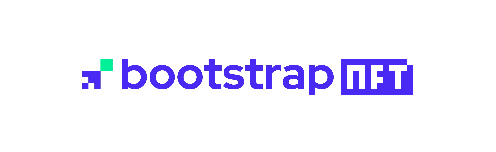
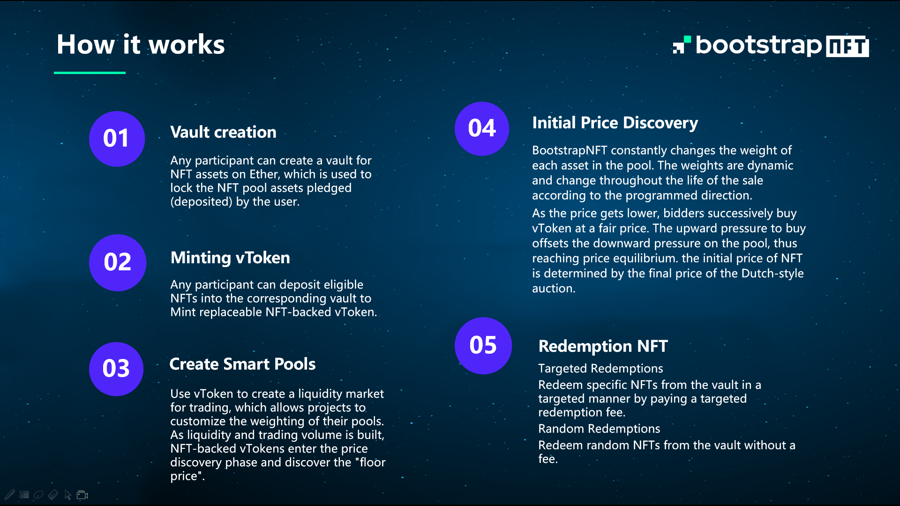

## 基本资料

项目名称：BootstrapNFT

项目立项日期：2022-05

## 项目整体简介

BootstrapNFT is an NFT liquidity auction platform. By establishing a liquidity market for NFT projects and conducting a "Dutch auction", it can discover the healthy and stable value of NFT assets.

BootstrapNFT tries to solve the problems of opaque pricing and robot race in the NFT market, so that people have enough opportunities to participate in transactions at a fair price.

## 黑客松期间计划完成的事项

**区块链端**

- `smart-contract`
  - [ ] NFT 碎片化工厂合约
  - [ ] NFT mint
  - [ ] NFT Redeem
  - [ ] NFT Auction工厂
  - [ ] NFT token Swap

**客户端**

- web 端
  - [ ] NFT 碎片化工厂合约创建与发布
  - [ ] NFT mint erc20
  - [ ] NFT 拍卖池创建

## 队员信息

poeticboat: 10 years development experience, proficient in public chain and cross chain development. **Wechat**:`m200909001`

zzm-Zhong: 10 years of work experience in IoT software development and management, familiar with contract and DAPP development.

qwwind: More than 10 years of software development experience, proficient in /Java/Golang/node, etc. engaged in blockchain research and development, familiar with eos/eth

erheng: Front end development, proficient in react and Vue, familiar with Web3 and polkadotjs API.
