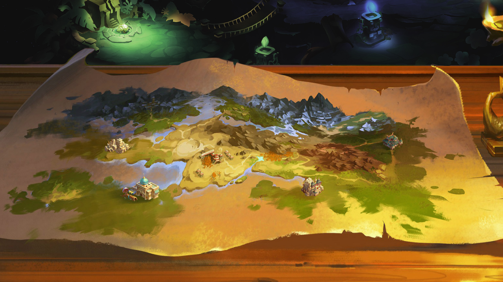
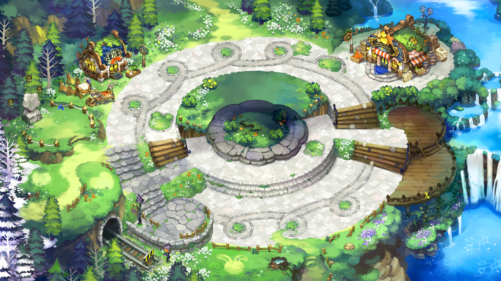
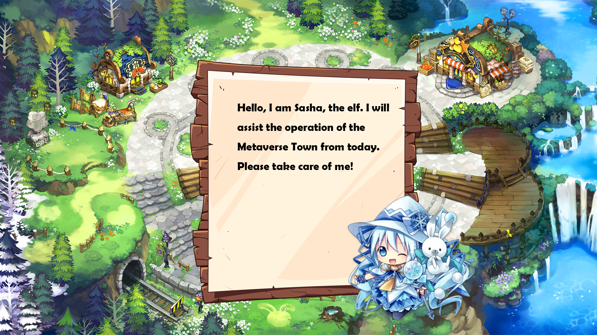

# [🔗 Demo Site ](https://h5.ylsd888.com/upload_res/test/chainGame/index.html) 

## **Project background/reason/problem to be solved**

With the explosion of the concept of the metaverse, more and more pioneers have come to this world. If you want to attract users' attention for a long time, you must continue to innovate and make players feel interesting and look forward to it. This is a suggestion for our metaverse game. Strong playability and high scalability requirements. The technology of hardware devices only contributes to a part of the human experience in the metaverse. The other two more important elements are the identity system and the value system. <warp gate> confirms the identity system through NFT. From early pioneering to later development, all participants plan independently. Just like the natural evolution of the entire world for thousands of years, <warp gate> gives players full degrees of freedom.

We are also thinking, the current metaverse games on the market are still in the early stages, and the experience is very rough. Why are so many people joining them?

We believe that what this group experiences is the presence of creation and co-creation (relationship). The Metaverse gives participants the freedom to unleash their creativity to create worlds, establish rules, and define value.

Friends who have played sandbox games know that there is nothing happier than a new world that you build brick by brick! If you want to say happier, it is to build a new world with your friends! Therefore, we believe that this group of sandbox game fans are naturally the builders of the metaverse and the expanders of new concepts, because they have already had too many experiences of creating worlds.

The presence of creativity and relationships is what attracts Metaverse builders.

It is human nature to position ourselves and think about the world through human interaction. If the Metaverse can use another dimension to allow people to establish more relationships and experience more experiences together, it will meet the needs of this part of humanity. <warp gate> is such a development game. Players make money in the game while developing their beloved village.Kevin Kelly said in the book "Inevitably"; "People will discover new jobs at new levels of productivity." In my opinion, new possibilities, new ways of working, new employment models, are all Possibilities in the Metaverse.

## **logo**

## **Project Introduction**

<warp gate>is a sandbox game combining metaverse Gamefi and NFT. The game design is both story and creativity. Construction, farming, fishing, adventure, exploration, combat, quests, puzzle solving, cooking, development of technology trees, etc. The gameplay is diverse and extensible, and it is committed to a good gaming experience whether it is a solo adventure or a team of friends.

In this era, everyone is a builder of the metaverse. <warp gate>players collect more and better NPCs by developing and upgrading village buildings, and finally in order to obtain more crystals (CSTL), get Become a governance participant of the metaverse game while making more profits.

## Story background**

Our story takes place in a chaotic void, which once had a prosperous past, but people forgot to have a beautiful ability in the gradual development.

Due to the chaos of time and space, there will be many past or future travelers in the town. Each traveler has their own story. Players can interact with NPCs/adventure with friends/explore new worlds, etc., and rebuild their own Small town, repair the gate of time and space, and at the same time earn money in the game, in order to return to the past life.

## Game mechanics

The daily gameplay of players is very rich, mainly including: upgrading village buildings, choosing the direction of the technology tree, interacting with travelers in the town, such as giving gifts/doing tasks, etc., inviting other players to explore dungeons together, and visiting other players’ towns /Interaction, capture small pets in dungeons, and in formation co-op mode, the income is doubled! You can also freely trade rare items and NFTs with other players in the auction house.

### **Tokenomics**

- Crystal (CSTL) is the main liquidity asset of the game
- Crystal (CSTL) does not have a fixed max liquidity
- Crystal CSTL loop
- R**elease path**
    - Players can get CSTL in game by (building level * time) stability
    - Players can get CSTL probabilistically in the game (adventure in the dungeon)
    
- G**et the path**
    - Players can get CSTL by selling their raw materials or synthetic materials in the trading market
    - Players can get CSTL by selling NFT assets in the NFT trading market
    
- C**onsumption path**
    - Players need to spend to upgrade buildings (in-game building materials + CSTL)
    - Players make synthetic materials, which need to be consumed (in-game building materials + CSTL)
    - Players allow NPCs to give birth to the next generation, which requires consumption (CSTL)
    - Players need to consume CSTL to buy raw materials or synthetic materials from other players in the trading market
    - Speed up time-consuming operations, which require consumption of CSTL
    - Players need to consume CSTL to buy NFT assets in the trading market
- and many more

## Things to do during a hackathon**

1. Complete the game plan;

2. According to the game plan, 80% of the demo functions are realized;