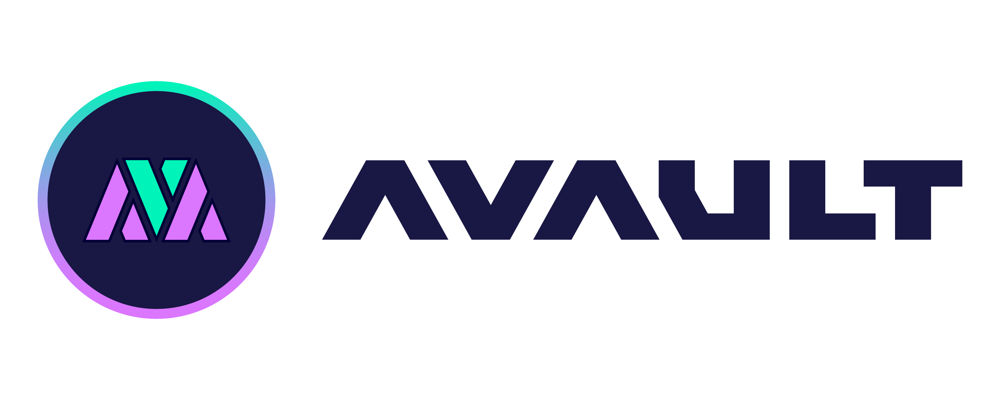

## 基本资料

项目名称：Avault

项目立项日期 (哪年哪月)：2022.2

## 项目整体简介

### Overview
Avault is a yield aggregator platform that provides aLP/aToken to DeFi users with automated compounding yields at empirically optimal intervals while pooling gas fees through smart contracts and best yield optimization strategies. At the same time, Avault is also a launchpad by using a whole new public sale strategy, which is called ISO.
### What is aLP/aToken? 
aLP/aToken is the receipt of your deposited LP/token. At the same time, it is an interest-bearing asset token. Every interest-bearing token will earn interest automatically, even if users only hold it without doing anything. Users can also stake their aLP/aToken into our farm to earn $AVAT.
### Why aLP/aToken?
The reason why we create the aLP and aToken is trying to rich the ecosystem. Even if the Avault token is all distributed in the future, the LP that users deposited in Avault can still be used by other projects.
We believe that aLP/aToken can become an essential part of ecosystem. The aLP/aToken can unlock the value of staked assets in the liquidity pools. All the defi projects can do lots of things by using our aLP/aToken. Let's say layer 0 is the asset on the ecosystem, for example the LP and the asset on dex, lending protocol or other dapps. Then the layer 1 will be the aLP/aToken. It is because users can deposit all their layer 0 asset into Avault to receive aLP/aToken. They can still receive their revenue from dex, lending protocol or other dapps. At the same time, users can stake their aLP/aToken to farm AVAT token for higher returns. They can also stake their aLP/aToken to other dapp for more use cases. Such as they can use it as collateral on lending protocol, aLP/aToken will have less risk of liquidation compared with single token, because the value of aLP/aToken continutely increasing. There are many other use cases that aLP/aToken can be applied. aLP/aToken can maximize the asset utilization on Astar ecosystem. So Avault is not only a simple yield aggregator, we are trying to rich the whole Astar defi ecosystem. Every defi user can benefit from this mechanism, and when the XCMP is available, aToken could also benefit all the polkadot users.
### What is ISO?
ISO means Initial Stake Offering. 50% users' principal will be used for adding initial liquidity with the project's public sale token. 40% users' principal will be used to create an ISO reward pool for the loyal holder award. 10% will be used for team operation and development. With this mechanism, ISO participants are guaranteed to get back at least 40% principal(Calculated by Currency Standard) if they are loyal holders.
### Why ISO?
Under the bear market, we believe that it would be difficult for the developer to raise the money from IDO. It might be because of the bear market situation and the users’ fear of losing all their money. It is reasonable that users do not want to take that high risk. However, this would be very hard for the builders to get through the bear market without operation fees.
Therefore, we designed ISO. We hope to rebuild the trust between users and projects via ISO. As we know, there are many users who may lose money on different IDO, especially in this market situation. We can’t guarantee participants must get 2x or 10x revenue, what we can guarantee is that participants would never lose all or even 90% principal.

### logo

## 黑客松期间计划完成的事项

**区块链端**

- `AVault Basic`
  - [✓] Compound Contracts (`AVaultForMasterChef`)
  - [✓] Zap Contracts (`ZapArthswap`)
  - [✓] ISO Contracts - Basic version (`PresaleShidenTest`)
  - [ ] ISO Contracts - Platform version (`Presale`)

**客户端**

- web 端
  - [ ] Home Page
  - [✓] Compound Page
  - [✓] Zap Page
  - [✓] ISO Page - Basic version
  - [ ] ISO Page - Platform version
  - [ ] ISO managment Page
  - [ ] ISO application Page

## 队员信息

包含参赛者名称及介绍
在团队中担任的角色
GitHub 帐号
微信账号（如有请留下，方便及时联系）
